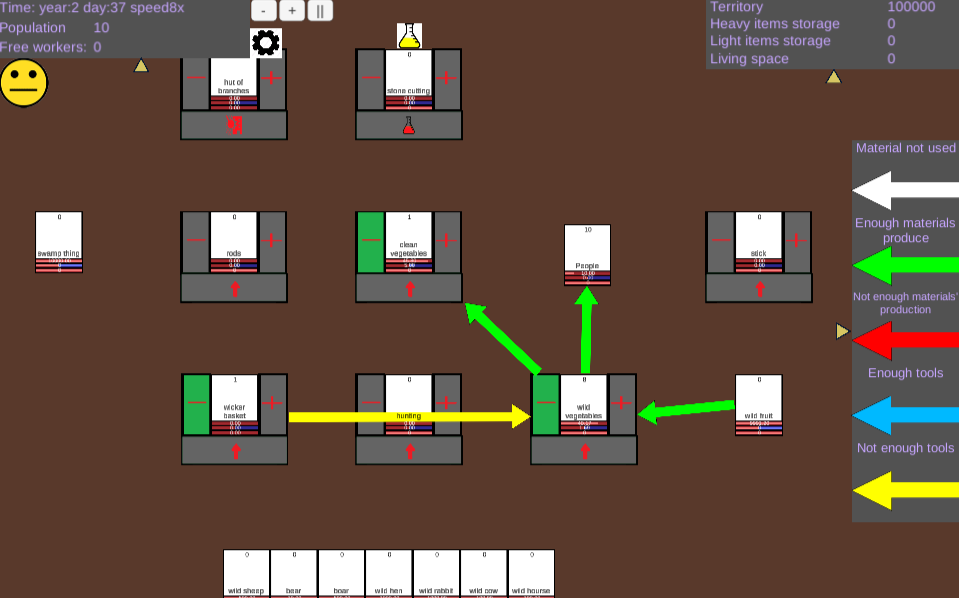

# ColonyRuler-code
Code of my game

ColonyRuler - game folder. Only nessessary files for Unity3D

SendLocalization - tool for sending localization into game server. Localization should be in Assert folder in the game folder.

XMLExport - export data from xml file into assert folder. Used XML and XSD files. Also, creates new localization files for Englins version.

ColonyRuler.xlsm - contain text content, data structure, links between it and so on.

sch.xsd - data maps for Excel.
sch.cs - generated file for exporting data from Excel. File generated from sch.xsd

Development.docx - design-document, including future plans.

